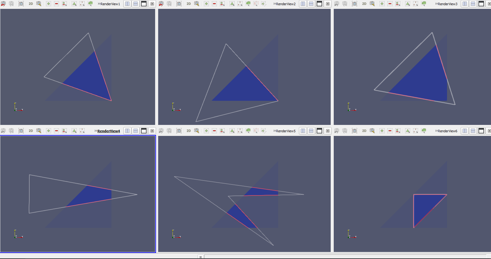
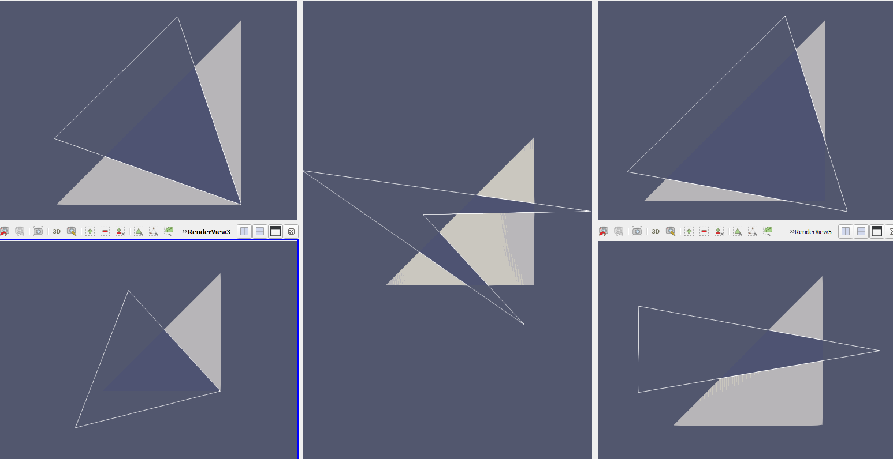
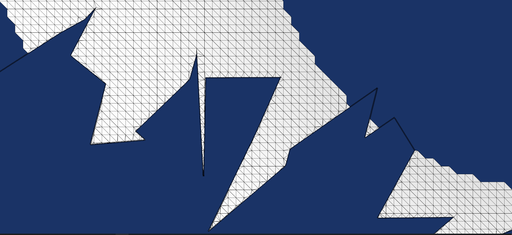
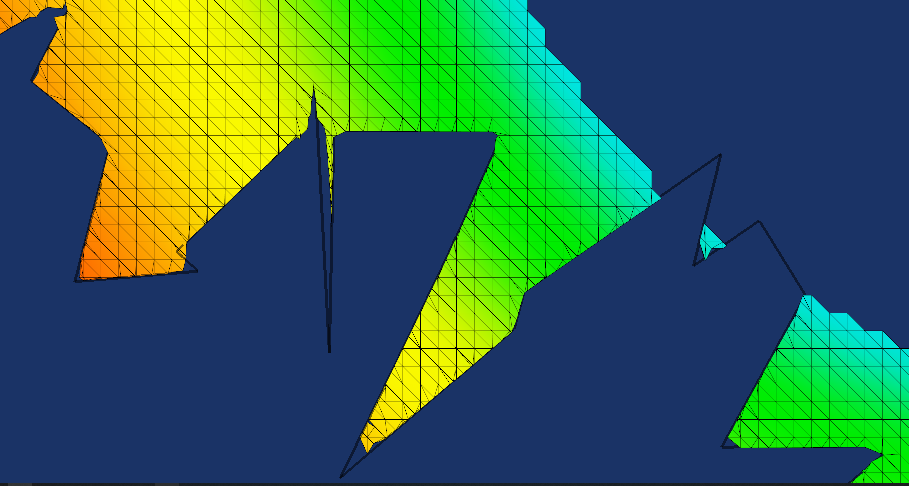
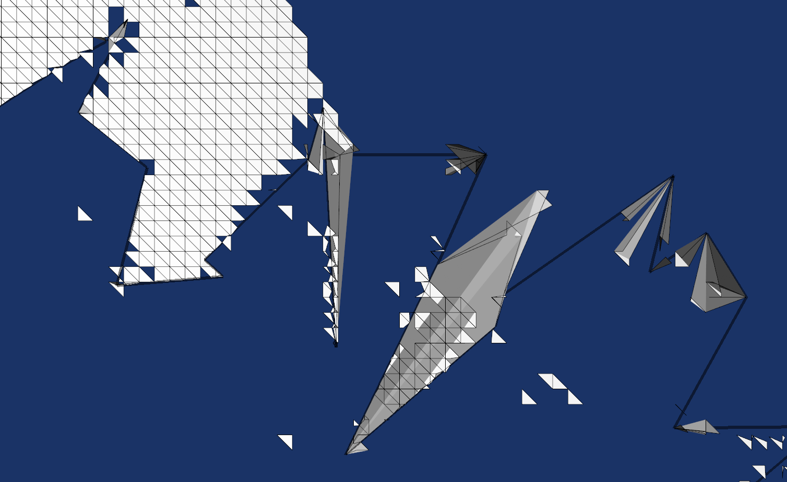

# SurfaceCutter
Cut portions of a triangulated surface with 2D polygons. 
The loop polygons are assumed to lie in x-y plane.

### Usage
```c++
#include <SurfaceCutter.h>

auto cutter = vtkSmartPointer<SurfaceCutter>::New();

// xxx: filter that outputs a vtkPolyData/vtkUnstrucutredGrid
cutter->SetInputConnection(0, xxx->GetOutputPort());

// yyy: filter that outputs a vtkPolyData
cutter->SetInputConnection(1, yyy->GetOutputPort());

// InsideOutOn: retain surface inside loops. InsideOutOff: retain surface outside loops.
cutter->InsideOutOn(); // (or) cutter->InsideOutOff(); default is on.

// ColorAcquiredPtsOn: Loop points will be tagged '1'. Remaining points will be tagged 0.
cutter->ColorAcquiredPtsOn(); // (or) cutter->ColorAcquiredPtsOff(); default is on.

// ColorLoopEdgesOn: Loop edges projected upon surface will be tagged '1'.
cutter->ColorLoopEdgesOn(); // (or) cutter->ColorLoopEdgesOff(); default is on.

cutter->Update();

cutMesh = cutter->GetOutput(0); 
projectedLoops = cutter->GetOutput(1);

```

## InsideOut = true


## InsideOut = false


## Translation/Rotation
With [SurfaceCutter](https://github.com/jaswantp/SurfaceCutter), it should be possible to
compute the cut mesh in realtime. Below are simple cases.


## SurfaceCutter
```
$ benchmark -m data/Surface.vtu -l data/TestPolys2.vtp
```

**closer...** *noice*

**even closer...** *goood*


## vtkClipDataSet
[vtkClipDataSet](https://vtk.org/doc/nightly/html/classvtkClipDataSet.html)
paired with 
[vtkImplicitSelectionLoop](https://vtk.org/doc/nightly/html/classvtkImplicitSelectionLoop.html)
and InsideOutOn.
```
$ benchmark -m data/Surface.vtu -l data/TestPolys2.vtp --vtkclipdataset
```
*janky around corners* *not goood*


## vtkCookieCutter
[vtkCookieCutter](https://vtk.org/doc/nightly/html/classvtkCookieCutter.html)
This filter doesn't yet support insideOut functionality. Check out [this MR](https://gitlab.kitware.com/vtk/vtk/-/merge_requests/5731)
```
$ benchmark -m data/Surface.vtu -l data/TestPolys2.vtp --vtkcookiecutter
```
*hmmm... oh no*


Now, about efficiency, 

# Test system and environment.
Compiler MSVC 19.27.29110
Release build VTK 9.0.1 with USE_64_BIT_IDS = true
CPU: Intel i7-8750H
Mem: 8G DDR4

The benchmark itself is a simple C++ program written using VTK library.
```
./benchmark.exe <option(s)>Options:
        -h,--help       Show this help message
        -m,--mesh       Specify mesh file (*.vtp, *.vtu)
        -l,--loops      Specify loops file (*.vtp)
        -i,--invert     Invert 2d boolean. Portions inside loops will be removed.
        -t,--translationspeed   Speed multiplier for mesh translations along x, y, z
        -r,--rotationspeed      Speed multiplier for mesh rotation along z
           --movable    Make the mesh movable.
           --vtkcookiecutter    Use vtkCookieCutter instead
           --vtkclipdataset     Use vtkClipDataset with vtkImplicitSelectionLoop instead


Controls:
W:    Z+ | S:     Z-
Up:   Y+ | Down:  Y-
Left: X+ | Right: X-
Z:   CCW | C:     CW (Looking down Z-)
```

The *benchmark* offers controls to *translate*/*rotate* the mesh. 
Such transformation recomputes the output of the surface cutters every frame.
An average over a couple 100 frames should tell who's better.
So, rotate the mesh with 'Z'/'C' and you should be able to reproduce the below results.


## Todo:
- WTF is up with the helper file, is that a computational geometry library of its own?
- Slim down to use VTK's data strucutres/functions rather than shuffling around STL-vtkIdLists.
- Abstract away bare necessities into functors and dispatch.
- Remove helper file. Implement functors in `.cxx` file

## Todo: detail
- Stick to vtkPointSetAlgorithm. Always output vtkPolyData (Library only cuts 2D triangular meshes)
- Extract method that appends inside out array to polys
- FFS, use `vtkPointData::CopyAllocate()` and `vtkPointData::CopyData()`. Generic, simpler, boosts readability
- Handle `vtkCellData` (Try)
- Use `vtkIdList`, `vtkDataArrayRanges` instead of shuffling around stl containers
- Try to not use `vtkDelaunay2D`.
- Yet, maintain efficiency demonstrated in `main` branch, if not, strive for better performance.